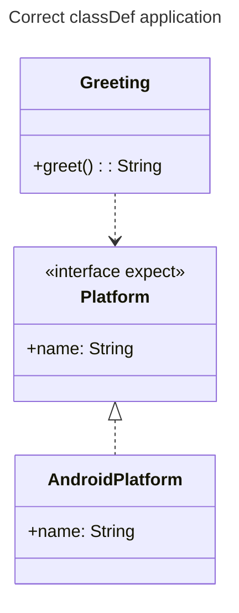

# Mermaid Syntax Gotchas — classDef and graph Rendering

**Extracted:** 2026-03-14
**Context:** Mermaid diagrams in markdown documentation that fail to render or lose styling

## Problem

Two categories of silent/visible Mermaid failures:

### 1. `:::classDef` on relationship lines (classDiagram)

Applying a `classDef` style on a relationship line does nothing — no error, just no styling.

```
// WRONG — silently ignored
Greeting:::domain --> Platform

// CORRECT — apply on the class declaration
class Greeting:::domain {
    +greet(): String
}
Greeting ..> Platform
```

### 2. Invalid syntax in `graph`/`flowchart` diagrams

| What you wrote | What's wrong | Fix |
|---|---|---|
| `note for X "text"` | Only valid in `classDiagram` | Move context to prose or blockquote below the diagram |
| `["label\nwith newline"]` | `\n` doesn't render in graph nodes | Use a short label; add context in surrounding prose |
| `A -->|long description| B` | Text on lines hurts readability and violates formatting rules | Use semantic arrow types; move text to a note or table |

## Solution

Before writing any Mermaid diagram, pick the right tool for context:

- `note for X "text"` → only in `classDiagram`
- `note right of X: text` → only in `sequenceDiagram`
- In `graph`/`flowchart`: add context in prose, blockquotes, or a table below the diagram

For `classDiagram` styling:
- Always apply `:::classDef` on the class declaration line, not the relationship line
- Relationship lines carry arrow types only (`..>`, `<|--`, `..|>`) — never styling

## Example



## When to Use

Apply this checklist whenever a Mermaid diagram fails to render or styles are missing:

1. Is `:::classDef` on a relationship line? → Move it to the class declaration
2. Is `note for` used inside a `graph` or `flowchart`? → Replace with prose/blockquote below the diagram
3. Are node labels using `\n` for line breaks? → Shorten the label; context goes in prose
4. Are arrows labeled with long text (`-->|description|`)? → Remove the label; use semantic arrow type instead
