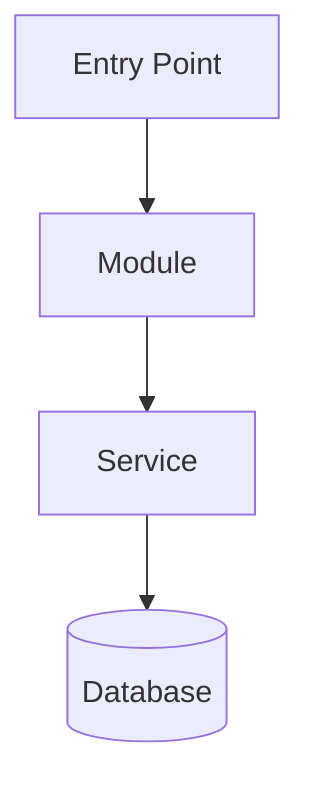

# Technical Documentation

Technical docs target **future developers** joining or working on the project. The goal is to help them quickly understand the codebase structure, architecture, and technical decisions — without guessing.

## When to Activate

- New module, feature, or service added to the codebase
- Architecture refactor or significant structural change
- New dependency or integration introduced
- Request to document, explain, or map the codebase
- Data flow between components needs clarification
- A developer asks "how does X work?" at a structural level

## Workflow

1. **Explore** — Use Glob and Grep to discover actual file structure, entry points, and module boundaries. Never assume paths.
2. **Analyze** — Identify frameworks, patterns, dependencies, and data flows from the real code.
3. **Diagram** — Create Mermaid diagrams for architecture, class relationships, sequences, or database schema.
4. **Reference** — Link only to file paths that actually exist in the codebase.
5. **Timestamp** — Every document gets `Last Updated: YYYY-MM-DD`.

## Diagram Standards (Mermaid)

Use the appropriate diagram type:



| Diagram type      | Use for                                  |
|-------------------|------------------------------------------|
| `graph TD`        | Architecture and component relationships |
| `sequenceDiagram` | API calls and data flows                 |
| `classDiagram`    | Domain models and class structures       |
| `erDiagram`       | Database schema                          |

Keep diagrams focused — one diagram per concern. Avoid putting everything in one mega-diagram.

## Output Structure

```
docs/technical/
├── README.md              # Technical overview and entry points
├── architecture.md        # High-level architecture diagram
├── modules/
│   └── [module-name].md   # Per-module documentation
└── data-flow.md           # How data moves through the system
```

## Document Format

```markdown
# [Component/Area] — Technical Documentation

**Last Updated:** YYYY-MM-DD
**Entry Points:** `path/to/main/file.kt`

## Architecture
[Mermaid diagram]

## File Structure
| Path | Purpose |
|------|---------|
| `src/...` | Description |

## Key Dependencies
- `library-name` — Purpose, version

## Data Flow
[Mermaid sequence or flow diagram]

## Related Documentation
- [Link to related technical docs]
```

## Quality Checklist

- [ ] All file paths verified to exist in the codebase (used Glob/Grep to confirm)
- [ ] Mermaid diagrams have valid syntax
- [ ] Dependencies listed with actual package names from build files
- [ ] `Last Updated` timestamp present
- [ ] No assumptions — only documented reality
- [ ] A developer with no prior context could understand the component from this doc alone
