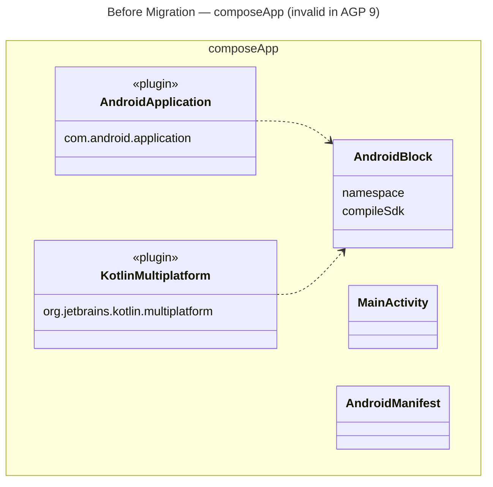
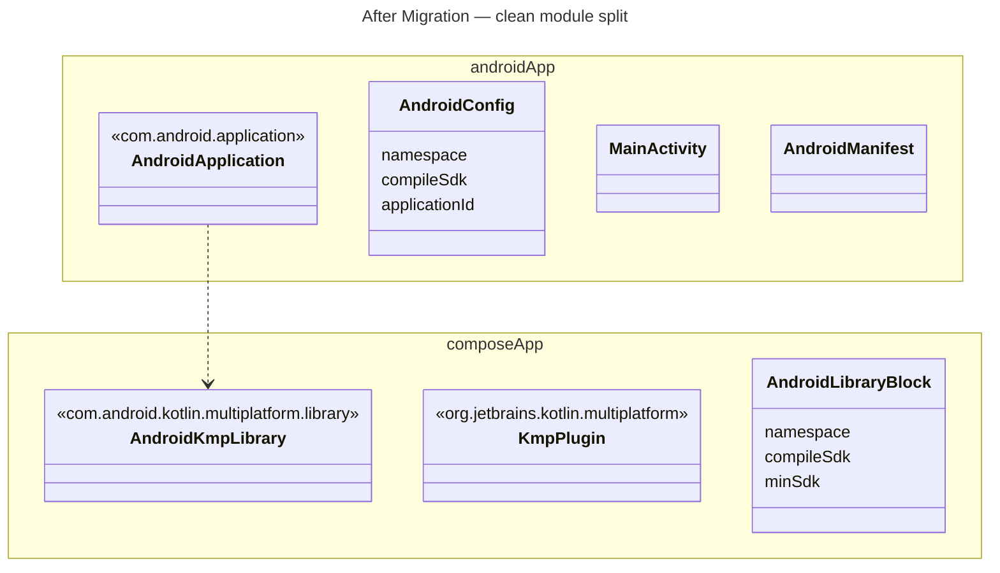
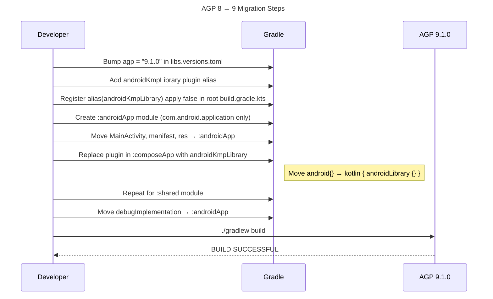
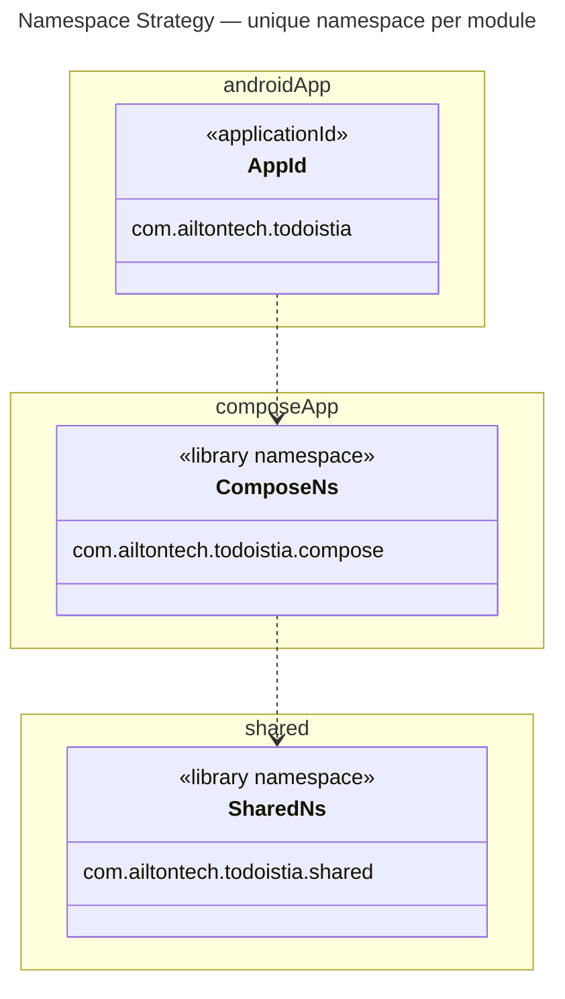

# AGP 8 → 9 Migration — Technical Documentation

**Last Updated:** 2026-03-14

## The Problem

AGP (Android Gradle Plugin) 9.x enforces one hard rule:

> **`com.android.application` or `com.android.library` cannot coexist with `org.jetbrains.kotlin.multiplatform` in the same Gradle subproject.**

In AGP 8.x, `:composeApp` used both plugins and had a top-level `android {}` block alongside `kotlin { multiplatform {} }`. AGP 9 refuses to build that configuration.

The solution is a module split: pull the Android application shell out into a new dedicated module (`:androidApp`), and convert `:composeApp` and `:shared` to use the new `com.android.kotlin.multiplatform.library` plugin.

---

## Before vs. After: Structure

### Before (AGP 8.x) — one module doing too much



> Both `AndroidApplication` and `KotlinMultiplatform` plugins in the same module — AGP 9 refuses to build this.

### After (AGP 9.x) — clean separation



---

## Migration Steps

### Step 1 — Bump AGP version in `libs.versions.toml`

**File:** `gradle/libs.versions.toml`

```diff
 [versions]
-agp = "8.x.x"
+agp = "9.1.0"
+kotlin = "2.3.10"
```

Add the new KMP library plugin alias:

```diff
 [plugins]
 androidApplication = { id = "com.android.application", version.ref = "agp" }
 androidLibrary     = { id = "com.android.library", version.ref = "agp" }
+androidKmpLibrary  = { id = "com.android.kotlin.multiplatform.library", version.ref = "agp" }
```

---

### Step 2 — Register the new plugin in root `build.gradle.kts`

**File:** `build.gradle.kts`

```diff
 plugins {
     alias(libs.plugins.androidApplication)  apply false
     alias(libs.plugins.androidLibrary)      apply false
+    alias(libs.plugins.androidKmpLibrary)   apply false
     alias(libs.plugins.composeMultiplatform) apply false
     alias(libs.plugins.composeCompiler)      apply false
     alias(libs.plugins.kotlinJvm)            apply false
     alias(libs.plugins.kotlinMultiplatform)  apply false
     alias(libs.plugins.ktor)                 apply false
 }
```

---

### Step 3 — Create the new `:androidApp` module

AGP 9 requires `com.android.application` to live in its own subproject with no KMP plugin.

**`settings.gradle.kts`:**

```diff
+include(":androidApp")
 include(":composeApp")
 include(":server")
 include(":shared")
```

**`androidApp/build.gradle.kts` (new file):**

```kotlin
plugins {
    alias(libs.plugins.androidApplication)
    alias(libs.plugins.composeMultiplatform)
    alias(libs.plugins.composeCompiler)
}

android {
    namespace   = "com.ailtontech.todoistia"
    compileSdk  = libs.versions.androidCompileSdk.get().toInt()

    defaultConfig {
        applicationId = "com.ailtontech.todoistia"
        minSdk        = libs.versions.androidMinSdk.get().toInt()
        targetSdk     = libs.versions.androidTargetSdk.get().toInt()
        versionCode   = 1
        versionName   = "1.0"
    }

    packaging {
        resources {
            excludes += "/META-INF/{AL2.0,LGPL2.1}"
        }
    }

    buildTypes {
        getByName("release") { isMinifyEnabled = false }
    }

    compileOptions {
        sourceCompatibility = JavaVersion.VERSION_11
        targetCompatibility = JavaVersion.VERSION_11
    }
}

dependencies {
    implementation(projects.composeApp)
    implementation(libs.androidx.activity.compose)
    debugImplementation(libs.compose.uiTooling)
}
```

**Move** `MainActivity.kt`, `AndroidManifest.xml`, and `res/` into `androidApp/src/main/`.

---

### Step 4 — Refactor `:composeApp` to use `androidKmpLibrary`

**`composeApp/build.gradle.kts` (before → after):**

```diff
 plugins {
-    alias(libs.plugins.androidApplication)  // or androidLibrary
     alias(libs.plugins.kotlinMultiplatform)
+    alias(libs.plugins.androidKmpLibrary)   // replaces android plugin
     alias(libs.plugins.composeMultiplatform)
     alias(libs.plugins.composeCompiler)
     alias(libs.plugins.composeHotReload)
 }

 kotlin {
-    androidTarget {
-        compilerOptions {
-            jvmTarget.set(JvmTarget.JVM_11)
-        }
-    }
+    androidLibrary {
+        namespace   = "com.ailtontech.todoistia.compose"
+        compileSdk  = 36
+        minSdk      = 24
+        compilerOptions { jvmTarget.set(JvmTarget.JVM_11) }
+        androidResources { enable = true }
+    }

     // other targets unchanged...
 }

-android {
-    namespace   = "com.ailtontech.todoistia"
-    compileSdk  = 36
-    // ... removed entirely
-}
```

> **Namespace uniqueness:** The KMP library uses `com.ailtontech.todoistia.compose` (not `.todoistia`) to avoid manifest merger collision with the `:androidApp` module that uses `com.ailtontech.todoistia`.

---

### Step 5 — Refactor `:shared` to use `androidKmpLibrary`

Same pattern as `:composeApp`, but without `androidResources`:

```diff
 plugins {
-    alias(libs.plugins.androidLibrary)
     alias(libs.plugins.kotlinMultiplatform)
+    alias(libs.plugins.androidKmpLibrary)
 }

 kotlin {
-    androidTarget {
-        compilerOptions { jvmTarget.set(JvmTarget.JVM_11) }
-    }
+    androidLibrary {
+        namespace  = "com.ailtontech.todoistia.shared"
+        compileSdk = 36
+        minSdk     = 24
+        compilerOptions { jvmTarget.set(JvmTarget.JVM_11) }
+    }
 }

-android {
-    namespace  = "com.ailtontech.todoistia.shared"
-    compileSdk = 36
-    // ... removed
-}
```

---

### Step 6 — Move `debugImplementation` to `:androidApp`

AGP 9 no longer accepts `debugImplementation` in KMP modules. Move debug dependencies to `:androidApp`, where the `com.android.application` plugin is in charge.

```diff
-debugImplementation(libs.compose.uiTooling)
+// Move to :androidApp/build.gradle.kts — debugImplementation is valid there
```

---

## Migration Flow

The steps above, in sequence:



---

## Plugin Compatibility Matrix

| Module        | AGP 8.x Plugin Used         | AGP 9.x Plugin Used                           |
|---------------|-----------------------------|-----------------------------------------------|
| `:androidApp` | `com.android.application`   | `com.android.application` (unchanged)          |
| `:composeApp` | `com.android.application`   | `com.android.kotlin.multiplatform.library`     |
| `:shared`     | `com.android.library`       | `com.android.kotlin.multiplatform.library`     |
| `:server`     | `org.jetbrains.kotlin.jvm`  | `org.jetbrains.kotlin.jvm` (unchanged)         |

---

## Namespace Strategy

Each module must have a unique namespace to avoid manifest merger collisions during the Android build. The `.compose` and `.shared` suffixes were added to the KMP library modules for this reason.



| Module        | Namespace                             | Why                                                   |
|---------------|---------------------------------------|-------------------------------------------------------|
| `:androidApp` | `com.ailtontech.todoistia`            | The `applicationId` — must be unique on the Play Store |
| `:composeApp` | `com.ailtontech.todoistia.compose`    | `.compose` suffix avoids collision with `:androidApp`  |
| `:shared`     | `com.ailtontech.todoistia.shared`     | `.shared` suffix keeps it distinct from both above     |

---

## Key Dependencies After Migration

```toml
# gradle/libs.versions.toml
[versions]
agp    = "9.1.0"
kotlin = "2.3.10"

[plugins]
androidApplication = { id = "com.android.application",                      version.ref = "agp" }
androidLibrary     = { id = "com.android.library",                          version.ref = "agp" }
androidKmpLibrary  = { id = "com.android.kotlin.multiplatform.library",     version.ref = "agp" }
kotlinMultiplatform = { id = "org.jetbrains.kotlin.multiplatform",          version.ref = "kotlin" }
```

---

## Related Documentation

- [Architecture overview](architecture.md)
- [Data Flow](data-flow.md)
