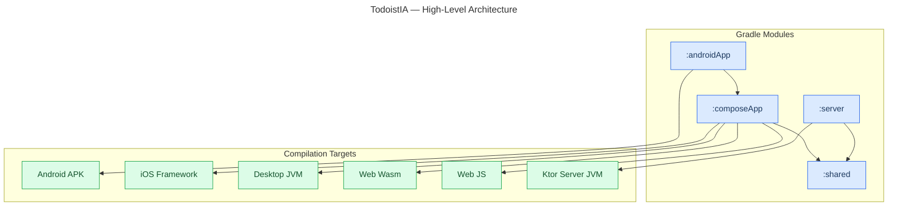
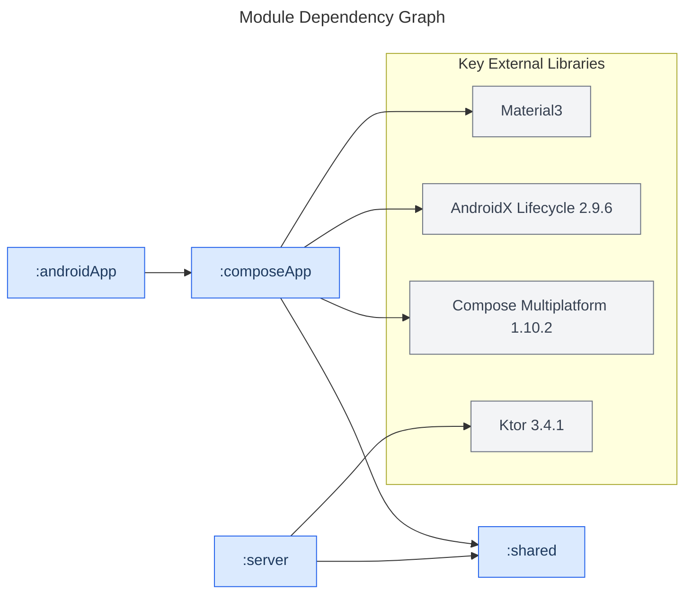

# Architecture — Technical Documentation

**Last Updated:** 2026-03-14

## Overview

TodoistIA is a Kotlin Multiplatform (KMP) project. The same business logic and UI code runs on Android, iOS, Desktop (JVM), and Web (Wasm/JS). A separate Ktor server provides the backend.

The project has four Gradle modules:

| Module        | What it is                                                   |
|---------------|--------------------------------------------------------------|
| `:androidApp` | The Android app shell — manifest, icon, and `MainActivity`   |
| `:composeApp` | All UI, written once in Compose and shared across platforms  |
| `:shared`     | Domain logic and platform utilities, shared by everyone      |
| `:server`     | Ktor backend server, runs on JVM                             |

> **Why four modules?** AGP 9 requires the Android application plugin to live in its own module, separate from any Kotlin Multiplatform module. See [AGP 9 Migration](agp9-migration.md) for the full story.

---

## High-Level Architecture

The diagram below shows which modules produce which compilation targets.

---

## Module Dependencies

`:androidApp` and `:server` are the two entry points. Both delegate to lower-level modules. `:shared` is the foundation — no external runtime dependencies.

---

## Compile Targets Per Module

Each module compiles to multiple platforms. `:shared` and `:composeApp` target all six platforms. `:androidApp` targets Android only. `:server` targets JVM only.

```mermaid
---
title: Compile Targets Per Module
---
%%{init: {'flowchart': {'curve': 'orthogonal'}}}%%
graph TD
    classDef module fill:#dbeafe,stroke:#2563eb,color:#1e3a5f
    classDef target fill:#dcfce7,stroke:#16a34a,color:#14532d

    shared[":shared"]:::module --> sAndroid[androidLibrary]:::target
    shared --> sIosArm64[iosArm64]:::target
    shared --> sIosSim[iosSimulatorArm64]:::target
    shared --> sJvm[jvm]:::target
    shared --> sJs[js/browser]:::target
    shared --> sWasm[wasmJs/browser]:::target

    composeApp[":composeApp"]:::module --> cAndroid[androidLibrary]:::target
    composeApp --> cIosArm64[iosArm64 Framework]:::target
    composeApp --> cIosSim[iosSimulatorArm64]:::target
    composeApp --> cJvm[jvm Desktop]:::target
    composeApp --> cJs[js/browser]:::target
    composeApp --> cWasm[wasmJs/browser]:::target

    androidApp[":androidApp"]:::module --> aAndroid[Android APK]:::target
    server[":server"]:::module --> sServer[JVM Netty]:::target
```

---

## Module Roles

| Module        | Plugin                                        | Role                                                |
|---------------|-----------------------------------------------|-----------------------------------------------------|
| `:androidApp` | `com.android.application`                     | Thin Android shell: `MainActivity`, manifest, icons |
| `:composeApp` | `com.android.kotlin.multiplatform.library`    | Shared UI for all platforms via Compose             |
| `:shared`     | `com.android.kotlin.multiplatform.library`    | Platform-agnostic domain logic (expect/actual)      |
| `:server`     | `org.jetbrains.kotlin.jvm` + `io.ktor.plugin` | Ktor backend server                                 |

---

## Key Files

| Path                          | Purpose                                      |
|-------------------------------|----------------------------------------------|
| `settings.gradle.kts`         | Module inclusion, repository config          |
| `build.gradle.kts`            | Root plugin declarations (`apply false`)     |
| `gradle/libs.versions.toml`   | Version catalog (AGP, Kotlin, Compose, Ktor) |
| `gradle.properties`           | Build performance flags, JVM memory          |
| `androidApp/build.gradle.kts` | Android application shell config             |
| `composeApp/build.gradle.kts` | Compose Multiplatform KMP library config     |
| `shared/build.gradle.kts`     | Core KMP library config                      |
| `server/build.gradle.kts`     | Ktor server config                           |

---

## Related Documentation

- [AGP 9 Migration — Step-by-step guide](agp9-migration.md)
- [Data Flow](data-flow.md)
