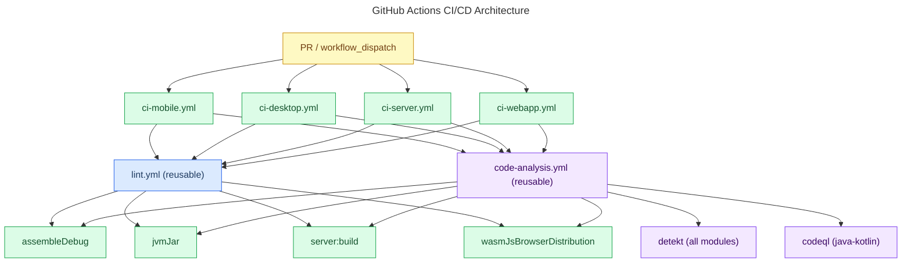

# CI/CD Pipeline

**Last Updated:** 2026-03-21

## Overview

Every PR triggers four platform-specific CI workflows (Mobile, Desktop, Server, Webapp). Each one runs **lint** and **code analysis** in parallel — if either fails, the build is skipped. All workflows can also be triggered manually from the GitHub Actions UI.

---

## Lint Workflow

**File:** `.github/workflows/lint.yml`

A reusable workflow that runs `./gradlew lintCheck` on all modules. It is called by all four principal workflows as their first job.

**Triggers:** `workflow_call` (called by other workflows), `workflow_dispatch` (manual)
**Runner:** `ubuntu-latest`, JDK 17, timeout 15 min

### Run lint locally

```bash
# Check for violations
./gradlew lintCheck

# Auto-fix formatting issues
./gradlew lintFormat

# Fix a single module
./gradlew :composeApp:ktlintFormat
./gradlew :server:ktlintFormat
```

---

## Code Analysis Workflow

**File:** `.github/workflows/code-analysis.yml`

A reusable workflow called by all four principal CI workflows in parallel with lint. It runs two independent jobs:

**Triggers:** `workflow_call`, `workflow_dispatch`
**Permissions required:** `contents: read`, `security-events: write`

### Job 1 — Detekt

Runs `./gradlew detektAll --no-daemon --continue` to analyze all modules statically. Uploads all SARIF + HTML reports as a single `detekt-reports` artifact (retained 14 days) and uploads SARIF to the **GitHub Security tab**.

### Job 2 — CodeQL

Initializes CodeQL for `java-kotlin`, uses autobuild to compile the project, then runs `security-extended` queries. Results appear in the **GitHub Security tab** under Code Scanning.

### Run detekt locally

```bash
# Analyze all modules
./gradlew detektAll

# Analyze a single module
./gradlew :server:detekt
./gradlew :composeApp:detekt

# Generate a baseline to grandfather existing violations
./gradlew detektBaseline
```

Reports are written to `<module>/build/reports/detekt/` as HTML and SARIF files.

---

## Principal CI Workflows

All four follow the same pattern: lint and code analysis run in parallel, then the platform build.

| Workflow | File             | Build command                           | Runner          | Timeout |
|----------|------------------|-----------------------------------------|-----------------|---------|
| Mobile   | `ci-mobile.yml`  | `:composeApp:assembleDebug`             | `macos-latest`  | 30 min  |
| Desktop  | `ci-desktop.yml` | `:composeApp:jvmJar`                    | `ubuntu-latest` | 20 min  |
| Server   | `ci-server.yml`  | `:server:build`                         | `ubuntu-latest` | 20 min  |
| Webapp   | `ci-webapp.yml`  | `:composeApp:wasmJsBrowserDistribution` | `ubuntu-latest` | 20 min  |

**Triggers:** `pull_request` to `master`, `develop`, or `staging` · `workflow_dispatch`

Mobile uses `macos-latest` to support future iOS build steps.

Each workflow's job graph:

```
lint (reusable)          ─┐
                           ├─ build (platform-specific)
code-analysis (reusable) ─┘
```

---

## Architecture



---

## Detekt Configuration

Detekt enforces Kotlin static analysis rules across all modules. Rules are **layered**: every module uses the base config; `composeApp` and `androidApp` additionally apply Compose-specific rules.

| Config file                   | Applies to                          |
|-------------------------------|-------------------------------------|
| `.detekt/detekt-base.yml`     | All modules                         |
| `.detekt/detekt-compose.yml`  | `composeApp`, `androidApp` only     |

### What detekt checks (base rules)

- **Complexity** — method length, cyclomatic complexity, parameter count, nesting depth
- **Coroutines** — `GlobalCoroutineUsage`, `SuspendFunSwallowedCancellation`
- **Exceptions** — swallowed exceptions, generic catch, missing messages
- **Performance** — spread operator misuse
- **Potential bugs** — double mutability, unsafe null operators, platform types
- **Style** — forbidden comments (`FIXME:`, `STOPSHIP:`), magic numbers, return count

Formatting is not part of detekt — ktlint owns formatting.

### Compose rules (composeApp + androidApp)

Uses `io.nlopez.compose.rules:detekt`. Key rules:
- `ModifierMissing` — top-level Composables must accept a `Modifier`
- `ViewModelForwarding` — don't pass ViewModels down the tree
- `RememberMissing` — expensive objects must be wrapped in `remember`
- `PreviewPublic` — Preview Composables should be `private` or `internal`
- `MultipleEmitters` — a Composable shouldn't emit more than one layout root

---

## Ktlint Configuration

Ktlint enforces Kotlin code style across all modules. It is applied in the root `build.gradle.kts` via `allprojects {}`, so every module is covered without any per-module setup.

### Settings (`.editorconfig`)

| Rule                  | Value           | Notes                                  |
|-----------------------|-----------------|----------------------------------------|
| `ktlint_code_style`   | `intellij_idea` | Matches IntelliJ defaults              |
| `max_line_length`     | `120`           | Not enforced in test/fake/mock files   |
| `no-wildcard-imports` | disabled        | Wildcard imports are allowed           |
| Compose rules         | enabled         | Enforced via `io.nlopez.compose.rules` |

**Test files** (`*Test.kt`, `*Fake*.kt`, `*Mock*.kt`) have `max_line_length = off` — long assertions and test data are fine.

### Compose rules

The `io.nlopez.compose.rules:ktlint` ruleset is wired in via `ktlintRuleset` in `build.gradle.kts`. It enforces:

- `modifier-missing` — Composables must accept a `Modifier` parameter
- `modifier-reused` — Don't reuse a modifier across multiple children
- `multiple-emitters-check` — A Composable shouldn't emit more than one layout root
- `preview-annotation-naming` — Preview functions must end with `Preview`
- `composable-function-name` — Composable functions must use PascalCase

---

## How Caching Works

Gradle caching is managed by `gradle/actions/setup-gradle@v4`:

- **On PRs** — cache is read-only (fast builds, can't pollute the shared cache)
- **On `master`, `develop`, `staging`** — cache is read-write (keeps the cache warm for everyone)

---

## Concurrency

Each workflow cancels any in-progress run on the same branch when a new commit is pushed:

```yaml
concurrency:
  group: ${{ github.workflow }}-${{ github.ref }}
  cancel-in-progress: true
```

This avoids wasting CI minutes on outdated commits.

---

## Troubleshooting

| Symptom                              | Cause                               | Fix                                                               |
|--------------------------------------|-------------------------------------|-------------------------------------------------------------------|
| Lint job fails                       | Style violations                    | Run `./gradlew lintFormat` locally                                |
| Code analysis job fails              | detekt violations                   | Run `./gradlew detektAll` locally; fix reported issues            |
| Too many detekt violations on first run | Existing code not yet compliant  | Generate a baseline: `./gradlew detektBaseline`                   |
| CodeQL build step fails              | JVM compilation error               | Fix compile errors in `:server`, `:shared`, or `:composeApp:jvm`  |
| Build job doesn't start              | Lint or code-analysis failed        | Fix both before build proceeds                                    |
| Compose rule violation               | Missing `Modifier` param, etc.      | See Compose rules above                                           |
| Slow first run                       | Empty Gradle cache                  | Second run will use the cache                                     |
| Mobile build fails on `macos-latest` | iOS toolchain issue                 | Check Xcode/KMP version compatibility                             |
| SARIF not appearing in Security tab  | GitHub Advanced Security not enabled | Enable it in repo Settings → Security → Code scanning            |

---

## Adding a New Workflow

1. Create `.github/workflows/your-workflow.yml`
2. Add lint and code-analysis as gating jobs:
   ```yaml
   jobs:
     lint:
       uses: ./.github/workflows/lint.yml

     code-analysis:
       uses: ./.github/workflows/code-analysis.yml
       permissions:
         contents: read
         security-events: write

     build:
       needs: [lint, code-analysis]
       ...
   ```
3. Use the same `concurrency` block and trigger branches as existing workflows

---

## Git Hooks

Git hooks automate local code quality checks before commits are made. Install them once, then they run automatically on every commit.

**File:** `scripts/git-hooks/`

### Installation

```bash
./gradlew installGitHooks
```

This runs `scripts/git-hooks/install-hooks.sh --force`, which copies hooks to `.git/hooks/` and makes them executable. The hooks are installed locally — they do not affect other developers automatically (each developer runs the installation once).

### pre-commit Hook

**File:** `scripts/git-hooks/pre-commit.sh`

Runs `ktlintFormat` on staged Kotlin files before the commit is created. This ensures every commit reflects properly formatted code.

**Behavior:**
1. Detects all staged `.kt` and `.kts` files via `git diff --cached --name-only --diff-filter=ACM`
2. Maps each file to its Gradle module by checking the first path component against `KNOWN_MODULES` in `settings.gradle.kts` (androidApp, composeApp, server, shared)
3. Runs `./gradlew :module:ktlintFormat --no-daemon` only for modules containing staged files
4. Root-level files (e.g. `build.gradle.kts`) trigger the aggregate `./gradlew ktlintFormat --no-daemon`
5. Re-stages all formatted files with `git add` so the commit includes the final formatted version
6. Aborts the commit if `ktlintFormat` fails — fix the errors and try again

**Example:**
```bash
# Stage some Kotlin files
git add src/main/kotlin/MyFile.kt androidApp/build.gradle.kts

# Attempt commit — pre-commit hook runs automatically
git commit -m "Add feature"

# Hook detects staged files in composeApp and root
# Runs: ./gradlew :composeApp:ktlintFormat ktlintFormat --no-daemon
# Re-stages the formatted files
# Commit proceeds with formatted code
```

### prepare-commit-msg Hook

**File:** `scripts/git-hooks/prepare-commit-msg.sh`

Automatically formats commit messages based on branch name convention. Extracts the ticket number and prefix from the branch name and inserts it into the commit message.

**Branch Convention:** `prefix/number-description`

**Supported Prefixes:** `feat`, `fix`, `hotfix`, `chore`, `docs`, `style`, `refactor`, `test`, `perf`, `ci`, `build`, `revert`

**Example:**
- Branch: `feat/123-add-login`
- Input message: `Add login screen`
- Output: `feat(#123): Add login screen`

If the input already starts with a prefix or emoji, the hook respects it and inserts the number:
- Input: `:bug: fix validation`
- Output: `:bug: fix(#123): validation`

### Skipping Hooks

When necessary, skip hooks for a single commit:

```bash
git commit --no-verify -m "message"
```

**Use sparingly** — hooks exist to prevent style drift and enforce consistency. Skipping should be rare and documented in the commit message or PR description.

### Bash 3 Compatibility

The pre-commit hook uses bash 3–compatible string deduplication (pipe-delimited deduplication) instead of associative arrays. This ensures it works on macOS (which ships with bash 3 by default) and other systems where bash 4 is not available.

---

## Related

- [Dependency Management](dependency-management.md) — Renovate, OWASP scans, version catalog
- [Architecture](architecture.md) — Module structure and compilation targets
