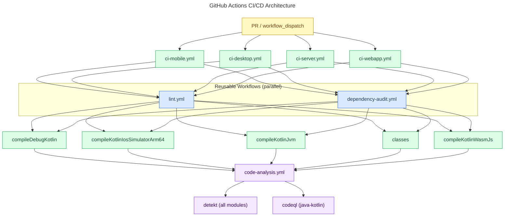

# CI/CD Pipeline

**Last Updated:** 2026-03-22

## Overview

Every PR triggers four platform-specific CI workflows (Mobile, Desktop, Server, Webapp). Each one runs **lint** and **dependency audit** in parallel, then compiles (compile-only, not full build), then runs **code analysis**. All workflows support manual dispatch with configurable inputs (environment, platform selection, test/deploy toggles).

---

## Pipeline Order

All four principal workflows follow the same sequential pipeline:

```
lint ──┐
       ├── compile ── [tests / coverage] ── code-analysis ── [release / deploy]
audit ─┘
```

| Stage            | Status          | Description                                               |
|------------------|-----------------|-----------------------------------------------------------|
| Lint             | Implemented     | ktlint check via reusable workflow                        |
| Audit            | Implemented     | OWASP dependency vulnerability scan via reusable workflow |
| Compile          | Implemented     | Platform-specific Kotlin compilation (compile-only)       |
| Tests / Coverage | Not implemented | Placeholder — skipped for now                             |
| Code Analysis    | Implemented     | detekt + CodeQL via reusable workflow                     |
| Deploy           | Not implemented | Placeholder — skipped for now                             |

---

## Triggers

All principal workflows support two trigger modes:

### PR trigger (automatic)

Fires on every `pull_request` targeting `master`, `develop`, or `staging`. All inputs use their default values — every platform builds, tests are not skipped, nothing is deployed.

### Manual trigger (`workflow_dispatch`)

Launch from the GitHub Actions UI with configurable inputs. The branch selector is built into GitHub's UI — no custom branch input is needed.

---

## Workflow Inputs

### ci-mobile.yml

| Input            | Type    | Default       | Description                                                |
|------------------|---------|---------------|------------------------------------------------------------|
| `environment`    | choice  | `development` | Target environment: development, test, staging, production |
| `build_android`  | boolean | `true`        | Build Android app                                          |
| `build_ios`      | boolean | `true`        | Build iOS app                                              |
| `skip_tests`     | boolean | `false`       | Skip test execution (not implemented yet)                  |
| `deploy_android` | boolean | `false`       | Deploy Android (not implemented yet)                       |
| `deploy_ios`     | boolean | `false`       | Deploy iOS (not implemented yet)                           |

### ci-desktop.yml / ci-webapp.yml / ci-server.yml

| Input         | Type    | Default       | Description                                                |
|---------------|---------|---------------|------------------------------------------------------------|
| `environment` | choice  | `development` | Target environment: development, test, staging, production |
| `skip_tests`  | boolean | `false`       | Skip test execution (not implemented yet)                  |
| `deploy`      | boolean | `false`       | Deploy (not implemented yet)                               |

---

## Conditional Platform Builds (ci-mobile)

The mobile workflow splits the build into two independent jobs (`build-android`, `build-ios`), each gated by its toggle:

```yaml
if: ${{ github.event_name != 'workflow_dispatch' || inputs.build_android }}
```

This means:
- **PR trigger** — both platforms always build (inputs are empty, condition is true)
- **Manual trigger** — only selected platforms build

Code analysis runs after builds, tolerating skipped platforms:

```yaml
needs: [build-android, build-ios]
if: >-
  !cancelled() &&
  (needs.build-android.result == 'success' || needs.build-android.result == 'skipped') &&
  (needs.build-ios.result == 'success' || needs.build-ios.result == 'skipped')
```

---

## Reusable Workflows

Three reusable workflows are called by all principal workflows:

| Workflow      | File                   | Trigger         | Purpose                                       |
|---------------|------------------------|-----------------|-----------------------------------------------|
| Lint          | `lint.yml`             | `workflow_call` | `./gradlew lintCheck` — ktlint on all modules |
| Audit         | `dependency-audit.yml` | `workflow_call` | OWASP Dependency Check vulnerability scan     |
| Code Analysis | `code-analysis.yml`    | `workflow_call` | detekt + CodeQL static analysis               |

---

## Lint Workflow

**File:** `.github/workflows/lint.yml`

Runs `./gradlew lintCheck` on all modules. Called by all four principal workflows as their first job (parallel with audit).

**Runner:** `ubuntu-latest`, JDK 17, timeout 15 min

### Run lint locally

```bash
# Check for violations
./gradlew lintCheck

# Auto-fix formatting issues
./gradlew lintFormat

# Fix a single module
./gradlew :composeApp:ktlintFormat
./gradlew :server:ktlintFormat
```

---

## Dependency Audit Workflow

**File:** `.github/workflows/dependency-audit.yml`

Runs OWASP Dependency Check (`./gradlew dependencyCheckAnalyze`) to scan for known CVEs in project dependencies. Uploads reports as artifacts (retained 30 days). Also runs independently on a weekly schedule (Sundays 02:00 UTC) and on pushes to main branches.

The `freshness` job (dependency staleness report) only runs on schedule or manual dispatch — it does not block PRs.

**Runner:** `ubuntu-latest`, JDK 17, timeout 30 min
**Secret required:** `NVD_API_KEY` (passed via `secrets: inherit`)

---

## Code Analysis Workflow

**File:** `.github/workflows/code-analysis.yml`

Runs two independent jobs:

**Permissions required:** `contents: read`, `security-events: write`

### Job 1 — Detekt

Runs `./gradlew detektAll --no-daemon --continue` to analyze all modules statically. Uploads all SARIF + HTML reports as a single `detekt-reports` artifact (retained 14 days) and uploads SARIF to the **GitHub Security tab**.

### Job 2 — CodeQL

Initializes CodeQL for `java-kotlin`, uses autobuild to compile the project, then runs `security-extended` queries. Results appear in the **GitHub Security tab** under Code Scanning.

### Run detekt locally

```bash
# Analyze all modules
./gradlew detektAll

# Analyze a single module
./gradlew :server:detekt
./gradlew :composeApp:detekt

# Generate a baseline to grandfather existing violations
./gradlew detektBaseline
```

Reports are written to `<module>/build/reports/detekt/` as HTML and SARIF files.

---

## Principal CI Workflows

| Workflow         | File             | Compile command                      | Runner          | Timeout |
|------------------|------------------|--------------------------------------|-----------------|---------|
| Mobile (Android) | `ci-mobile.yml`  | `:androidApp:compileDebugKotlin`     | `ubuntu-latest` | 30 min  |
| Mobile (iOS)     | `ci-mobile.yml`  | `:composeApp:compileKotlinIosSimulatorArm64` | `macos-latest`  | 45 min  |
| Desktop          | `ci-desktop.yml` | `:composeApp:compileKotlinJvm`       | `ubuntu-latest` | 20 min  |
| Server           | `ci-server.yml`  | `:server:classes`                    | `ubuntu-latest` | 20 min  |
| Webapp           | `ci-webapp.yml`  | `:composeApp:compileKotlinWasmJs`    | `ubuntu-latest` | 20 min  |

**Key design**: CI step is compile-only verification, NOT artifact production. Each module compiles independently; the shared module is compiled transitively through module dependencies. iOS requires `macos-latest` for Kotlin/Native; all others use `ubuntu-latest` (cheaper and faster).

### Job graph (desktop / webapp / server)

```
lint ──┐
       ├── compile ── [tests/coverage] ── code-analysis ── [release / deploy]
audit ─┘
```

### Job graph (mobile)

```
lint ──┐
       ├── compile-android ──┐
audit ─┘                     ├── [tests/coverage] ── code-analysis ── [release / deploy]
version ┐ (optional)         │
        ├── compile-ios ─────┘
       └── (parallel)
```

---

## Architecture


```mermaid
---
title: GitHub Actions CI/CD Architecture
---
%%{init: {'flowchart': {'curve': 'orthogonal'}}}%%
graph TD
    classDef trigger fill:#fef9c3,stroke:#ca8a04,color:#713f12
    classDef reusable fill:#dbeafe,stroke:#2563eb,color:#1e3a5f
    classDef compile fill:#dcfce7,stroke:#16a34a,color:#14532d
    classDef analysis fill:#f3e8ff,stroke:#7c3aed,color:#3b0764

    PR["PR / workflow_dispatch"]:::trigger

    PR --> Mobile["ci-mobile.yml"]:::compile
    PR --> Desktop["ci-desktop.yml"]:::compile
    PR --> Server["ci-server.yml"]:::compile
    PR --> Webapp["ci-webapp.yml"]:::compile

    subgraph "Reusable Workflows (parallel)"
        Lint["lint.yml"]:::reusable
        Audit["dependency-audit.yml"]:::reusable
    end

    Mobile --> Lint
    Mobile --> Audit
    Desktop --> Lint
    Desktop --> Audit
    Server --> Lint
    Server --> Audit
    Webapp --> Lint
    Webapp --> Audit

    Lint --> CompileAndroid["compileDebugKotlin"]:::compile
    Audit --> CompileAndroid
    Lint --> CompileIOS["compileKotlinIosSimulatorArm64"]:::compile
    Audit --> CompileIOS
    Lint --> CompileDesktop["compileKotlinJvm"]:::compile
    Audit --> CompileDesktop
    Lint --> CompileServer["classes"]:::compile
    Audit --> CompileServer
    Lint --> CompileWasm["compileKotlinWasmJs"]:::compile
    Audit --> CompileWasm

    CompileAndroid --> CA["code-analysis.yml"]:::analysis
    CompileIOS --> CA
    CompileDesktop --> CA
    CompileServer --> CA
    CompileWasm --> CA

    CA --> Detekt["detekt (all modules)"]:::analysis
    CA --> CodeQL["codeql (java-kotlin)"]:::analysis
```

---

## Compile-Only Architecture

The CI pipeline runs **compile-only** Gradle tasks, not full builds. This is a deliberate design choice that separates concerns:

- **CI (compile-only)** — Verifies code compiles, no artifacts produced
- **Deploy (artifact production)** — Runs full builds, packaging (JAR, APK, wheel, etc.), only when deploying to production

### Why compile-only in CI?

1. **Faster feedback** — Compilation is 5-10x faster than full packaging
2. **Reduced redundancy** — No point building artifacts that won't be deployed
3. **Separated concerns** — Each workflow focuses on a single responsibility
4. **Transitive compilation** — The shared module compiles automatically as a dependency of other modules

### Compile tasks by platform

| Platform | Task                            | What it does                                          |
|----------|--------------------------------|-------------------------------------------------------|
| Android  | `:androidApp:compileDebugKotlin` | Compiles Kotlin sources for Android (app + shared)   |
| iOS      | `:composeApp:compileKotlinIosSimulatorArm64` | Kotlin/Native compilation for iOS simulator         |
| Desktop  | `:composeApp:compileKotlinJvm`  | Compiles JVM sources (composeApp + shared)           |
| Server   | `:server:classes`                | Compiles Kotlin sources for server (server + shared) |
| Webapp   | `:composeApp:compileKotlinWasmJs` | Compiles to WebAssembly (composeApp + shared)       |

---

## Environment Variables

All principal CI workflows inject environment variables needed for compilation. These are **non-sensitive** configuration variables, not secrets.

### GitHub Variables (non-sensitive)

Configure these in repo Settings → Variables:

| Variable      | Example              | Used By                             |
|---------------|----------------------|-------------------------------------|
| `APP_ENV`     | `dev`, `test`, `staging`, `prod` | All workflows (defaults to `dev`)   |
| `SERVER_PORT` | `8080`               | All workflows (Ktor config)         |
| `SERVER_HOST` | `localhost`          | All workflows (Ktor config)         |

### GitHub Secrets (sensitive)

Configure these in repo Settings → Secrets:

| Secret          | Purpose                         | Used By            |
|-----------------|----------------------------------|--------------------|
| `NVD_API_KEY`   | OWASP Dependency Check API key   | All workflows      |
| `TODOIST_TOKEN` | Todoist API token (if needed)    | All workflows      |

### Injection pattern in workflows

```yaml
- name: Compile [Platform]
  run: ./gradlew [task] --no-daemon
  env:
    APP_ENV: ${{ vars.APP_ENV || 'dev' }}
    NVD_API_KEY: ${{ secrets.NVD_API_KEY }}
    TODOIST_TOKEN: ${{ secrets.TODOIST_TOKEN }}
    SERVER_PORT: ${{ vars.SERVER_PORT }}
    SERVER_HOST: ${{ vars.SERVER_HOST }}
```

---

## iOS Build Requirements

iOS compilation requires special handling:

### Konan Cache

Kotlin/Native downloads the Konan toolchain (~500 MB) on first run. CI caches it to speed up subsequent builds:

```yaml
- name: Cache Kotlin/Native (Konan)
  uses: actions/cache@v4
  with:
    path: ~/.konan
    key: konan-${{ runner.os }}-${{ hashFiles('gradle/libs.versions.toml') }}
    restore-keys: |
      konan-${{ runner.os }}-
```

Cache is invalidated when `gradle/libs.versions.toml` changes (new Kotlin version, Konan target updates).

### Memory and Runner

- **Runner:** `macos-latest` (only platform with iOS toolchain)
- **Memory:** `GRADLE_OPTS: "-Xmx4g"` — Kotlin/Native compilation is memory-intensive
- **Timeout:** 45 minutes (vs. 30 min for Android, due to Konan overhead)

---

## Detekt Configuration

Detekt enforces Kotlin static analysis rules across all modules. Rules are **layered**: every module uses the base config; `composeApp` and `androidApp` additionally apply Compose-specific rules.

| Config file                   | Applies to                          |
|-------------------------------|-------------------------------------|
| `.detekt/detekt-base.yml`     | All modules                         |
| `.detekt/detekt-compose.yml`  | `composeApp`, `androidApp` only     |

### What detekt checks (base rules)

- **Complexity** — method length, cyclomatic complexity, parameter count, nesting depth
- **Coroutines** — `GlobalCoroutineUsage`, `SuspendFunSwallowedCancellation`
- **Exceptions** — swallowed exceptions, generic catch, missing messages
- **Performance** — spread operator misuse
- **Potential bugs** — double mutability, unsafe null operators, platform types
- **Style** — forbidden comments (`FIXME:`, `STOPSHIP:`), magic numbers, return count

Formatting is not part of detekt — ktlint owns formatting.

### Compose rules (composeApp + androidApp)

Uses `io.nlopez.compose.rules:detekt`. Key rules:
- `ModifierMissing` — top-level Composables must accept a `Modifier`
- `ViewModelForwarding` — don't pass ViewModels down the tree
- `RememberMissing` — expensive objects must be wrapped in `remember`
- `PreviewPublic` — Preview Composables should be `private` or `internal`
- `MultipleEmitters` — a Composable shouldn't emit more than one layout root

---

## Ktlint Configuration

Ktlint enforces Kotlin code style across all modules. It is applied in the root `build.gradle.kts` via `allprojects {}`, so every module is covered without any per-module setup.

### Settings (`.editorconfig`)

| Rule                  | Value           | Notes                                  |
|-----------------------|-----------------|----------------------------------------|
| `ktlint_code_style`   | `intellij_idea` | Matches IntelliJ defaults              |
| `max_line_length`     | `120`           | Not enforced in test/fake/mock files   |
| `no-wildcard-imports` | disabled        | Wildcard imports are allowed           |
| Compose rules         | enabled         | Enforced via `io.nlopez.compose.rules` |

**Test files** (`*Test.kt`, `*Fake*.kt`, `*Mock*.kt`) have `max_line_length = off` — long assertions and test data are fine.

### Compose rules

The `io.nlopez.compose.rules:ktlint` ruleset is wired in via `ktlintRuleset` in `build.gradle.kts`. It enforces:

- `modifier-missing` — Composables must accept a `Modifier` parameter
- `modifier-reused` — Don't reuse a modifier across multiple children
- `multiple-emitters-check` — A Composable shouldn't emit more than one layout root
- `preview-annotation-naming` — Preview functions must end with `Preview`
- `composable-function-name` — Composable functions must use PascalCase

---

## How Caching Works

Gradle caching is managed by `gradle/actions/setup-gradle@v4`:

- **On PRs** — cache is read-only (fast builds, can't pollute the shared cache)
- **On `master`, `develop`, `staging`** — cache is read-write (keeps the cache warm for everyone)

---

## Concurrency

Each workflow cancels any in-progress run on the same branch when a new commit is pushed:

```yaml
concurrency:
  group: ${{ github.workflow }}-${{ github.ref }}
  cancel-in-progress: true
```

This avoids wasting CI minutes on outdated commits.

---

## Troubleshooting

| Symptom                                 | Cause                                | Fix                                                              |
|-----------------------------------------|--------------------------------------|------------------------------------------------------------------|
| Lint job fails                          | Style violations                     | Run `./gradlew lintFormat` locally                               |
| Code analysis job fails                 | detekt violations                    | Run `./gradlew detektAll` locally; fix reported issues           |
| Too many detekt violations on first run | Existing code not yet compliant      | Generate a baseline: `./gradlew detektBaseline`                  |
| CodeQL build step fails                 | JVM compilation error                | Fix compile errors in `:server`, `:shared`, or `:composeApp:jvm` |
| Compile job doesn't start               | Lint or audit failed                 | Fix both before compile proceeds                                 |
| Code analysis doesn't start             | Compile failed                       | Fix the compile first — code analysis runs after compile         |
| Compose rule violation                  | Missing `Modifier` param, etc.       | See Compose rules above                                          |
| Slow first run (Android, Server, Desktop, Webapp) | Empty Gradle cache         | Second run will use the cache                                    |
| Slow first iOS run                      | Empty Konan cache                    | Konan (~500 MB) downloads on first run; cached thereafter        |
| iOS compile fails on `macos-latest`     | iOS/Kotlin/Native version mismatch   | Check Xcode version and `libs.versions.toml` Kotlin version      |
| Konan cache keeps getting invalidated   | `gradle/libs.versions.toml` changed  | Expected — cache key includes libs.versions.toml hash            |
| SARIF not appearing in Security tab     | GitHub Advanced Security not enabled | Enable it in repo Settings → Security → Code scanning            |
| Audit fails with NVD error              | Missing or expired `NVD_API_KEY`     | Add/renew the secret in repo Settings → Secrets                  |
| Compile fails with env var errors       | Missing GitHub Variables             | Add `APP_ENV`, `SERVER_PORT`, `SERVER_HOST` in Settings → Variables |

---

## Adding a New Workflow

1. Create `.github/workflows/your-workflow.yml`
2. Add `workflow_dispatch` inputs following the standard pattern:
   ```yaml
   on:
     pull_request:
       branches: ["master", "develop", "staging"]
     workflow_dispatch:
       inputs:
         environment:
           type: choice
           options: [development, test, staging, production]
           default: development
         skip_tests:
           type: boolean
           default: false
         deploy:
           type: boolean
           default: false
   ```
3. Add lint and audit as parallel gating jobs, then compile, then code-analysis:
   ```yaml
   jobs:
     lint:
       uses: ./.github/workflows/lint.yml

     audit:
       uses: ./.github/workflows/dependency-audit.yml
       secrets: inherit

     compile:
       needs: [lint, audit]
       runs-on: ubuntu-latest
       steps:
         - uses: actions/checkout@v4
         - uses: actions/setup-java@v4
           with:
             java-version: "17"
             distribution: "temurin"
         - uses: gradle/actions/setup-gradle@v4
         - run: ./gradlew :[module]:classes --no-daemon
           env:
             APP_ENV: ${{ vars.APP_ENV || 'dev' }}
             NVD_API_KEY: ${{ secrets.NVD_API_KEY }}
             TODOIST_TOKEN: ${{ secrets.TODOIST_TOKEN }}
             SERVER_PORT: ${{ vars.SERVER_PORT }}
             SERVER_HOST: ${{ vars.SERVER_HOST }}

     code-analysis:
       needs: [compile]
       uses: ./.github/workflows/code-analysis.yml
       permissions:
         contents: read
         security-events: write
   ```
4. Use the same `concurrency` block and trigger branches as existing workflows

---

## Git Hooks

Git hooks automate local code quality checks before commits are made. Install them once, then they run automatically on every commit.

**File:** `scripts/git-hooks/`

### Installation

```bash
./gradlew installGitHooks
```

This runs `scripts/git-hooks/install-hooks.sh --force`, which copies hooks to `.git/hooks/` and makes them executable. The hooks are installed locally — they do not affect other developers automatically (each developer runs the installation once).

### pre-commit Hook

**File:** `scripts/git-hooks/pre-commit.sh`

Runs `ktlintFormat` on staged Kotlin files before the commit is created. This ensures every commit reflects properly formatted code.

**Behavior:**
1. Detects all staged `.kt` and `.kts` files via `git diff --cached --name-only --diff-filter=ACM`
2. Maps each file to its Gradle module by checking the first path component against `KNOWN_MODULES` in `settings.gradle.kts` (androidApp, composeApp, server, shared)
3. Runs `./gradlew :module:ktlintFormat --no-daemon` only for modules containing staged files
4. Root-level files (e.g. `build.gradle.kts`) trigger the aggregate `./gradlew ktlintFormat --no-daemon`
5. Re-stages all formatted files with `git add` so the commit includes the final formatted version
6. Aborts the commit if `ktlintFormat` fails — fix the errors and try again

**Example:**
```bash
# Stage some Kotlin files
git add src/main/kotlin/MyFile.kt androidApp/build.gradle.kts

# Attempt commit — pre-commit hook runs automatically
git commit -m "Add feature"

# Hook detects staged files in composeApp and root
# Runs: ./gradlew :composeApp:ktlintFormat ktlintFormat --no-daemon
# Re-stages the formatted files
# Commit proceeds with formatted code
```

### prepare-commit-msg Hook

**File:** `scripts/git-hooks/prepare-commit-msg.sh`

Automatically formats commit messages based on branch name convention. Extracts the ticket number and prefix from the branch name and inserts it into the commit message.

**Branch Convention:** `prefix/number-description`

**Supported Prefixes:** `feat`, `fix`, `hotfix`, `chore`, `docs`, `style`, `refactor`, `test`, `perf`, `ci`, `build`, `revert`

**Example:**
- Branch: `feat/123-add-login`
- Input message: `Add login screen`
- Output: `feat(#123): Add login screen`

If the input already starts with a prefix or emoji, the hook respects it and inserts the number:
- Input: `:bug: fix validation`
- Output: `:bug: fix(#123): validation`

### Skipping Hooks

When necessary, skip hooks for a single commit:

```bash
git commit --no-verify -m "message"
```

**Use sparingly** — hooks exist to prevent style drift and enforce consistency. Skipping should be rare and documented in the commit message or PR description.

### Bash 3 Compatibility

The pre-commit hook uses bash 3–compatible string deduplication (pipe-delimited deduplication) instead of associative arrays. This ensures it works on macOS (which ships with bash 3 by default) and other systems where bash 4 is not available.

---

## Related

- [Dependency Management](dependency-management.md) — Renovate, OWASP scans, version catalog
- [Architecture](architecture.md) — Module structure and compilation targets
