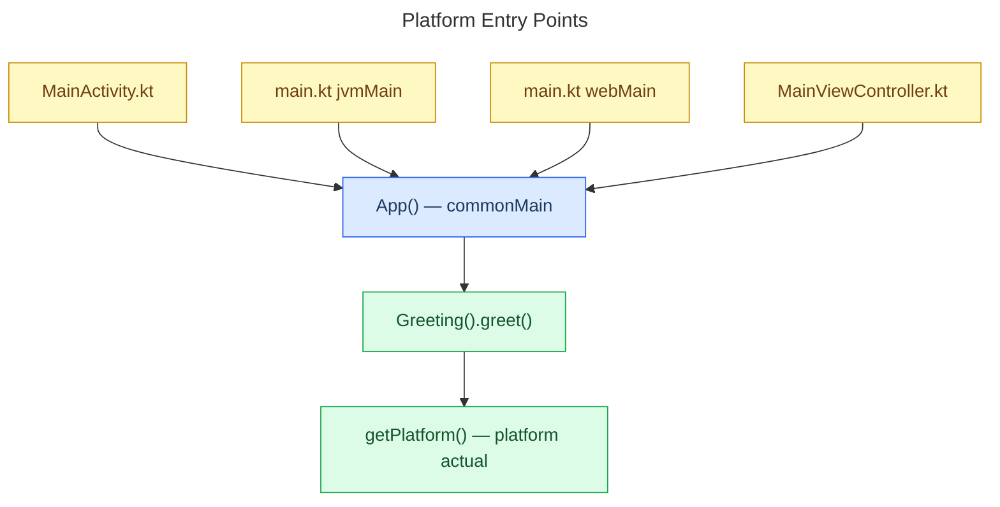
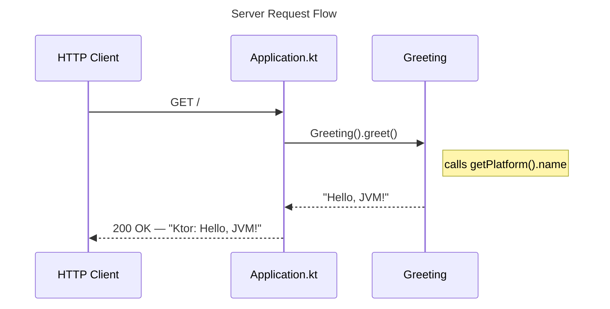
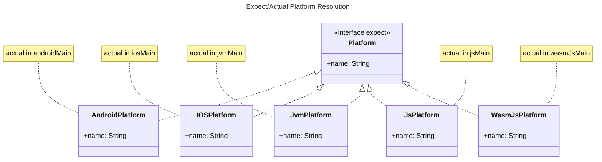
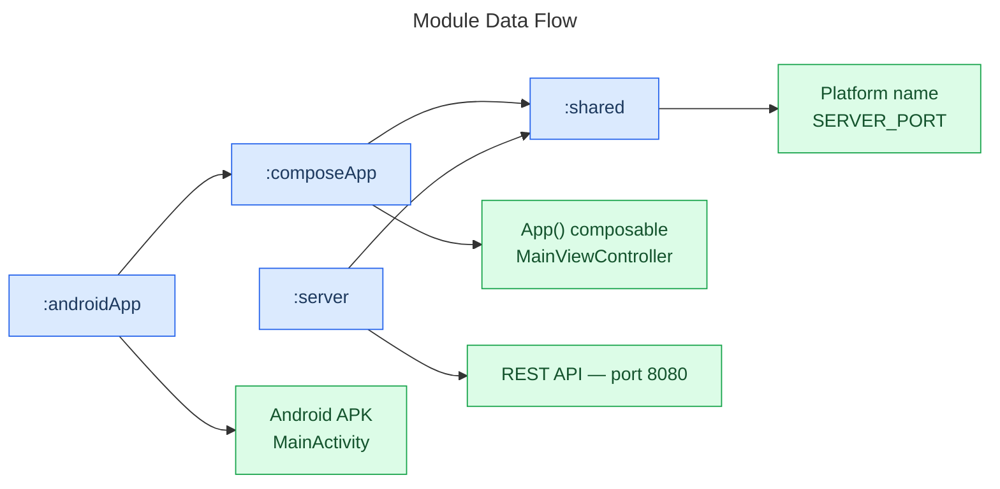

# Data Flow — Technical Documentation

**Last Updated:** 2026-03-14

## Overview

This document explains how data moves through TodoistIA — from the platform entry points down to shared domain logic, and from the HTTP client through the Ktor server.

The key idea: every platform starts the app differently, but they all converge on the same `App()` composable from `:composeApp`, which in turn calls into `:shared` for business logic.

---

## Platform Entry Points

Each platform boots the app in its own way, but all of them call the same `App()` composable from `:composeApp/commonMain`.

> `getPlatform()` is an `expect` function declared in `:shared/commonMain`. Each platform provides its own `actual` implementation that returns the platform name (e.g. `"Android 34"`, `"iOS 17.0"`, `"JVM 17"`).

---

## Server Request Flow

The Ktor server handles HTTP requests independently. It also uses `:shared` for the `Greeting` logic and port constant.

**Server Port:** `SERVER_PORT = 8080` — defined in `shared/commonMain/Constants.kt` and shared with the server module.

---

## Expect/Actual Platform Resolution

The `Platform` interface is the `expect`/`actual` contract that lets `:shared` work on every platform without platform-specific imports.

---

## Module Data Flow

At the module level, data flows in one direction: from entry points down to `:shared`.

---

## Related Documentation

- [Architecture overview](architecture.md)
- [AGP 9 Migration](agp9-migration.md)