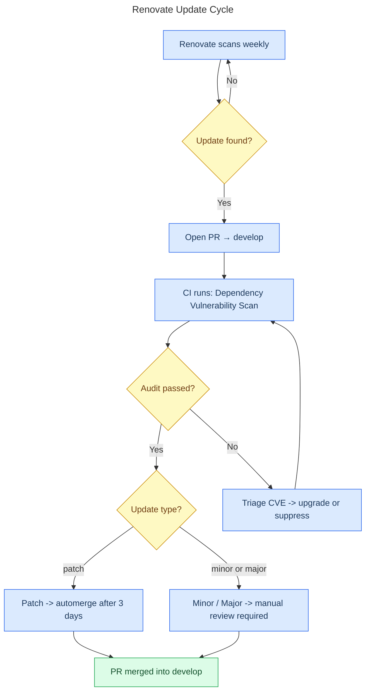

# Dependency Management

Dependency updates are automated by two tools working together:

- **Renovate Bot** — opens PRs when libraries are outdated
- **OWASP Dependency Check** — scans for known security vulnerabilities (CVEs)

Together they keep the project fresh and secure with minimal manual effort.

_Last Updated: 2026-03-16_

---

## Renovate Cycle

The diagram below shows the full lifecycle of a dependency update, from Renovate's weekly scan to the final merge.



---

## How Renovate Works

Renovate runs every weekend and opens pull requests targeting `develop` for outdated dependencies found in:

- `gradle/libs.versions.toml` — all Gradle libraries and plugins
- `gradle/wrapper/gradle-wrapper.properties` — Gradle itself
- `.github/workflows/` — GitHub Actions

### Update rules

| Type        | What happens                                                    |
|-------------|-----------------------------------------------------------------|
| **Patch**   | Auto-merged after CI passes + 3-day stability window            |
| **Minor**   | PR opened, requires manual review, 3-day stability window       |
| **Major**   | PR opened, requires manual review, labeled `breaking-change`    |

### Grouped PRs

Related packages are bundled into one PR so updates stay coherent:

| Group                 | Matched packages                                    |
|-----------------------|-----------------------------------------------------|
| Kotlin                | `org.jetbrains.kotlin*`, `org.jetbrains.kotlinx*`   |
| Compose Multiplatform | `org.jetbrains.compose*`, `org.jetbrains.androidx*` |
| Ktor                  | `io.ktor*`                                          |
| AndroidX              | `androidx.*`                                        |
| AGP                   | `com.android.*`                                     |

### Dependency Dashboard

Renovate creates a pinned **Dependency Dashboard** GitHub Issue. Use it to see all pending updates, currently open PRs, and to manually trigger a Renovate run.

---

## Vulnerability Scanning

The `dependencyCheckAnalyze` Gradle task scans all modules (`shared`, `composeApp`, `androidApp`, `server`) for known CVEs from the NVD database.

**Failure threshold:** any CVE with CVSS ≥ 7.0 (High or Critical) fails the build. Lower severities are reported but non-blocking.

### Run locally

```bash
./gradlew dependencyCheckAnalyze
# Reports: build/reports/dependency-check-report.html and .sarif
```

### Run in CI

The `dependency-audit` workflow runs on every PR and every push to `develop`, `staging`, and `master`, plus weekly on Sundays at 02:00 UTC.

### Suppress a false positive

Sometimes the scanner flags a CVE that doesn't apply to this project's usage. To suppress it:

1. Run the audit and open `build/reports/dependency-check-report.html`
2. Confirm the CVE is a false positive
3. Add an entry to `dependency-check-suppression.xml` and re-run to confirm it passes:

   ```xml
   <suppress>
       <notes><![CDATA[
           False positive: CVE-XXXX-YYYY affects the C library, not the JVM binding.
           Reviewed on YYYY-MM-DD.
       ]]></notes>
       <cve>CVE-XXXX-YYYY</cve>
   </suppress>
   ```

4. Commit `dependency-check-suppression.xml` with a note explaining the decision.

---

## Dependency Freshness Report

To check for newer stable versions without a full CVE scan:

```bash
./gradlew dependencyUpdates
# Report: build/reports/dependencyUpdates/dependency-updates.html
```

This also runs on the weekly CI schedule and uploads the report as an artifact.

---

## Adding a New Dependency

1. Add the version to `gradle/libs.versions.toml`:
   ```toml
   # [versions]
   my-library = "1.2.3"

   # [libraries]
   my-library = { module = "com.example:my-library", version.ref = "my-library" }
   ```
2. Use it in a module's `build.gradle.kts`:
   ```kotlin
   implementation(libs.myLibrary)
   ```

Renovate picks up the new entry automatically on its next scan.

---

## Gradle Plugins Catalog

The project uses a **version catalog** in `gradle/libs.versions.toml` to manage all dependencies and plugins centrally. Key plugins:

| Plugin                    | Version | Purpose                            |
|---------------------------|---------|-------------------------------------|
| `androidApplication`      | 9.1.0   | Android app shell                   |
| `androidLibrary`          | 9.1.0   | Android library modules             |
| `androidKmpLibrary`       | 9.1.0   | Kotlin Multiplatform on Android     |
| `composeMultiplatform`    | 1.10.2  | Compose UI framework                |
| `kotlinJvm`               | 2.3.10  | Kotlin JVM targets                  |
| `kotlinMultiplatform`     | 2.3.10  | Kotlin Multiplatform                |
| `ktor`                    | 3.4.1   | Ktor server plugin                  |
| `owaspDependencyCheck`    | 12.2.0  | Vulnerability scanning              |
| `benManesVersions`        | 0.53.0  | Dependency freshness reporting      |
| **`ktlint`**              | 12.2.0  | **Kotlin code style enforcement**   |

Plugins are declared in `build.gradle.kts` using `alias(libs.plugins.<name>) apply false`, ensuring versions stay in sync and updates flow through Renovate.

---

## Environment Variables

The build reads `APP_ENV` to load the right `.env.{env}` file (default: `dev`). System environment variables always take precedence over the file.

| Variable      | Purpose                                                 | Required in CI         |
|---------------|---------------------------------------------------------|------------------------|
| `APP_ENV`     | Active environment: `dev`, `test`, `staging`, or `prod` | No (defaults to `dev`) |
| `NVD_API_KEY` | Speeds up OWASP scans and avoids NVD rate limiting      | Recommended            |

**Local setup:**

```bash
cp .env.dev.example .env.dev
# Fill in real values — .env.dev is gitignored
```

> Never commit a `.env.*` file. Only `.env.*.example` templates are committed.

---

## Reviewing a Renovate PR

1. Open the Dependency Dashboard issue to understand the scope
2. Read the PR — Renovate links to changelogs and release notes
3. **Patch:** CI auto-merges after the audit passes — no action needed
4. **Minor/Major:** review breaking changes, test locally if needed, then merge
5. **Audit failure:** check the report, then either upgrade further or add a suppression

---

## NVD API Key Setup

Without a key the OWASP plugin is rate-limited by the NVD, making scans slow or flaky.

1. Request a free key: <https://nvd.nist.gov/developers/request-an-api-key>
2. Add it locally to `.env.dev`:
   ```
   NVD_API_KEY=your-key-here
   ```
3. In CI: add it as a GitHub secret named `NVD_API_KEY` (Settings → Secrets → Actions)
