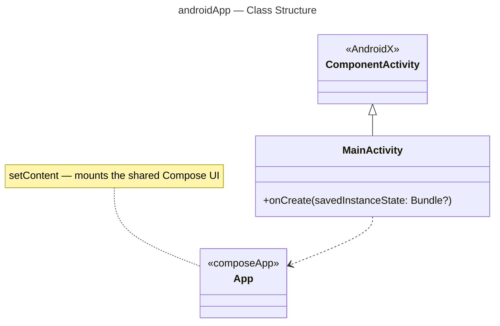

# :androidApp — Module Documentation

**Last Updated:** 2026-03-14
**Entry Point:** `androidApp/src/main/kotlin/com/ailtontech/todoistia/MainActivity.kt`

## Purpose

`:androidApp` is a thin Android application shell. It exists solely because AGP 9 requires the `com.android.application` plugin to live in its own module — separate from any Kotlin Multiplatform module.

This module contains only what is Android-application-specific:
- `MainActivity.kt` — starts the app and sets the Compose content
- `AndroidManifest.xml` — app manifest and permissions
- `res/` — drawable icons and values

All UI logic lives in `:composeApp`. This module just launches it.

## Build Configuration

```kotlin
// androidApp/build.gradle.kts
plugins {
    alias(libs.plugins.androidApplication)   // com.android.application — only allowed here
    alias(libs.plugins.composeMultiplatform)
    alias(libs.plugins.composeCompiler)
}

android {
    namespace  = "com.ailtontech.todoistia"
    compileSdk = 36

    defaultConfig {
        applicationId = "com.ailtontech.todoistia"
        minSdk        = 24
        targetSdk     = 36
        versionCode   = 1
        versionName   = "1.0"
    }
}
```

## File Structure

| Path                                             | Purpose                  |
|--------------------------------------------------|--------------------------|
| `androidApp/build.gradle.kts`                    | Module build config      |
| `androidApp/src/main/kotlin/.../MainActivity.kt` | Android entry point      |
| `androidApp/src/main/AndroidManifest.xml`        | App manifest             |
| `androidApp/src/main/res/`                       | Drawables, icons, values |

## Class Diagram

`MainActivity` extends `ComponentActivity` (from AndroidX) and calls `setContent` to mount the shared `App()` composable.



## Dependencies

| Dependency                  | Purpose                                   |
|-----------------------------|-------------------------------------------|
| `projects.composeApp`       | Shared Compose UI                         |
| `androidx-activity-compose` | `ComponentActivity` + Compose integration |
| `compose.uiTooling` (debug) | Layout inspector                          |

## Related Documentation

- [AGP 9 Migration](../agp9-migration.md)
- [:composeApp module](composeApp.md)
