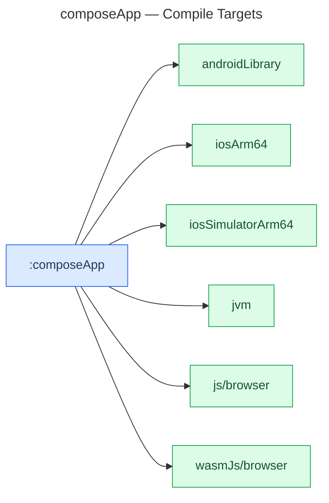

# :composeApp — Module Documentation

**Last Updated:** 2026-03-14

**Entry Points (per platform):**
- Android: consumed as a library by `:androidApp`
- Desktop: `composeApp/src/jvmMain/kotlin/com/ailtontech/todoistia/main.kt`
- Web: `composeApp/src/webMain/kotlin/com/ailtontech/todoistia/main.kt`
- iOS: `composeApp/src/iosMain/kotlin/com/ailtontech/todoistia/MainViewController.kt`

## Purpose

`:composeApp` is the shared UI layer. The `App()` composable is written once in `commonMain` and runs identically on Android, iOS, Desktop, and Web. This is the core promise of Compose Multiplatform.

After the AGP 9 migration, this module uses `com.android.kotlin.multiplatform.library` instead of `com.android.application`. It is now a library consumed by `:androidApp`.

## Build Configuration

```kotlin
// composeApp/build.gradle.kts
plugins {
    alias(libs.plugins.kotlinMultiplatform)
    alias(libs.plugins.androidKmpLibrary)    // AGP 9 — replaces androidApplication
    alias(libs.plugins.composeMultiplatform)
    alias(libs.plugins.composeCompiler)
    alias(libs.plugins.composeHotReload)
}

kotlin {
    androidLibrary {                         // replaces androidTarget{} + android{}
        namespace  = "com.ailtontech.todoistia.compose"
        compileSdk = 36
        minSdk     = 24
        compilerOptions { jvmTarget.set(JvmTarget.JVM_11) }
        androidResources { enable = true }
    }
    iosArm64()
    iosSimulatorArm64()
    jvm()
    js { browser(); binaries.executable() }
    wasmJs { browser(); binaries.executable() }
}
```

## File Structure

| Path                                           | Purpose                     |
|------------------------------------------------|-----------------------------|
| `composeApp/build.gradle.kts`                  | Module build config         |
| `src/commonMain/kotlin/.../App.kt`             | Root `App()` composable     |
| `src/commonMain/composeResources/`             | Shared drawable resources   |
| `src/jvmMain/kotlin/.../main.kt`               | Desktop Window entry point  |
| `src/webMain/kotlin/.../main.kt`               | Web Viewport entry point    |
| `src/iosMain/kotlin/.../MainViewController.kt` | iOS ComposeUIViewController |
| `src/commonTest/kotlin/`                       | Shared UI tests             |

## Compile Targets

This module compiles to six targets. Each produces a platform-specific binary or library.



## Key Dependencies

| Dependency                            | Purpose                        |
|---------------------------------------|--------------------------------|
| `compose-runtime`                     | Compose runtime                |
| `compose-foundation`                  | Layouts and gestures           |
| `compose-material3`                   | Material You components        |
| `compose-ui`                          | UI toolkit                     |
| `compose-components-resources`        | `composeResources/` access     |
| `androidx-lifecycle-viewmodelCompose` | ViewModel in Compose           |
| `kotlinx-coroutinesSwing`             | Desktop coroutine dispatcher   |
| `projects.shared`                     | Domain logic and platform info |

## Related Documentation

- [AGP 9 Migration](../agp9-migration.md)
- [:androidApp module](androidApp.md)
- [:shared module](shared.md)
