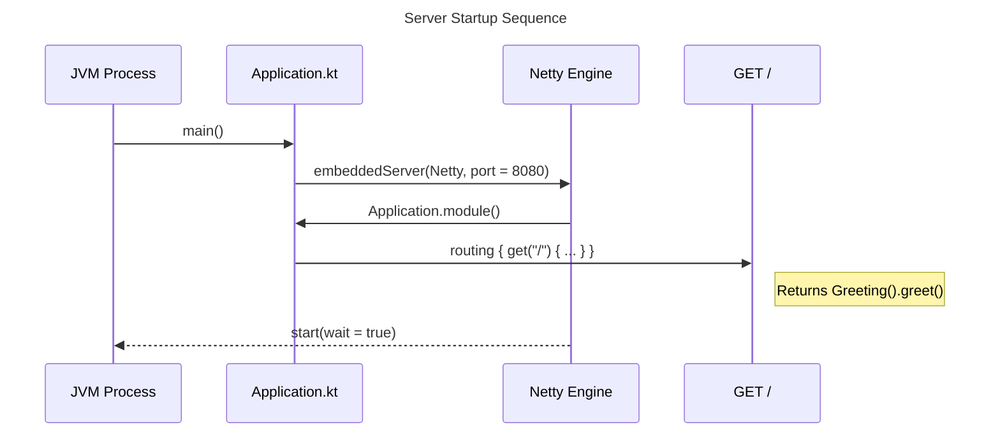

# :server — Module Documentation

**Last Updated:** 2026-03-14
**Entry Point:** `server/src/main/kotlin/com/ailtontech/todoistia/Application.kt`

## Purpose

`:server` is a Ktor backend server running on the JVM. It exposes a REST API and depends on `:shared` for the `Greeting` logic and the server port constant (`SERVER_PORT = 8080`).

Unlike the other modules, `:server` is JVM-only — it does not compile to Android or other platforms.

## Build Configuration

```kotlin
// server/build.gradle.kts
plugins {
    alias(libs.plugins.kotlinJvm)
    alias(libs.plugins.ktor)
    application
}

group   = "com.ailtontech.todoistia"
version = "1.0.0"

application {
    mainClass.set("com.ailtontech.todoistia.ApplicationKt")
}
```

## File Structure

| Path                                     | Purpose                            |
|------------------------------------------|------------------------------------|
| `server/build.gradle.kts`                | Module build config                |
| `src/main/kotlin/.../Application.kt`     | Ktor server setup + routing        |
| `src/main/resources/logback.xml`         | Logging configuration              |
| `src/test/kotlin/.../ApplicationTest.kt` | Ktor test client integration tests |

## Server Startup Sequence

When the JVM process starts, `main()` in `Application.kt` creates a Netty engine, registers the application module (routes), and starts listening.



## Endpoints

| Method | Path | Response                        |
|--------|------|---------------------------------|
| `GET`  | `/`  | `"Ktor: ${Greeting().greet()}"` |

## Key Dependencies

| Dependency                   | Purpose                   |
|------------------------------|---------------------------|
| `projects.shared`            | `SERVER_PORT`, `Greeting` |
| `ktor-serverCore`            | Ktor routing and pipeline |
| `ktor-serverNetty`           | Netty HTTP engine         |
| `logback`                    | Structured logging        |
| `ktor-serverTestHost` (test) | In-process test client    |
| `kotlin-testJunit` (test)    | JUnit test runner         |

## Related Documentation

- [:shared module](shared.md)
- [Data Flow](../data-flow.md)
- [Architecture overview](../architecture.md)
