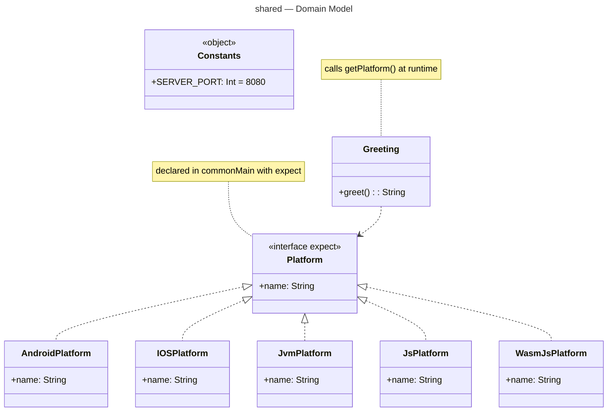

# :shared — Module Documentation

**Last Updated:** 2026-03-14
**Entry Point:** `shared/src/commonMain/kotlin/com/ailtontech/todoistia/`

## Purpose

`:shared` is the foundation of the project. It contains platform-agnostic domain logic that every other module depends on:

- **`Platform`** — an `expect`/`actual` interface that lets code in `commonMain` ask "what platform am I running on?" Each platform provides its own `actual` implementation.
- **`Greeting`** — a simple business logic class that uses `Platform` to produce a greeting string.
- **`Constants`** — shared constants (e.g. `SERVER_PORT = 8080`) used by both the server and client.

**Design principle:** `:shared` has no external runtime dependencies. It is pure Kotlin. This keeps it lightweight and usable on every target platform.

## Build Configuration

```kotlin
// shared/build.gradle.kts
plugins {
    alias(libs.plugins.kotlinMultiplatform)
    alias(libs.plugins.androidKmpLibrary)    // AGP 9 — replaces androidLibrary
}

kotlin {
    androidLibrary {
        namespace  = "com.ailtontech.todoistia.shared"
        compileSdk = 36
        minSdk     = 24
        compilerOptions { jvmTarget.set(JvmTarget.JVM_11) }
    }
    iosArm64()
    iosSimulatorArm64()
    jvm()
    js { browser() }
    wasmJs { browser() }
}
```

## File Structure

| Path                                             | Purpose                                |
|--------------------------------------------------|----------------------------------------|
| `shared/build.gradle.kts`                        | Module build config                    |
| `src/commonMain/kotlin/.../Platform.kt`          | `expect fun getPlatform(): Platform`   |
| `src/commonMain/kotlin/.../Greeting.kt`          | Greeting use case (uses platform name) |
| `src/commonMain/kotlin/.../Constants.kt`         | `SERVER_PORT = 8080`                   |
| `src/androidMain/kotlin/.../Platform.android.kt` | Android `actual` implementation        |
| `src/iosMain/kotlin/.../Platform.ios.kt`         | iOS `actual` implementation            |
| `src/jvmMain/kotlin/.../Platform.jvm.kt`         | JVM `actual` implementation            |
| `src/jsMain/kotlin/.../Platform.js.kt`           | JS `actual` implementation             |
| `src/wasmJsMain/kotlin/.../Platform.wasmJs.kt`   | WasmJs `actual` implementation         |
| `src/commonTest/kotlin/`                         | Shared unit tests                      |

## Class Diagram

`Greeting` uses `Platform` to build its message. `Platform` is implemented five times — once per target platform.



## Key Dependencies

| Dependency                 | Purpose                |
|----------------------------|------------------------|
| `kotlin-test` (commonTest) | Shared test assertions |

No external runtime dependencies — intentional to keep `:shared` as a pure Kotlin module.

## Related Documentation

- [AGP 9 Migration](../agp9-migration.md)
- [Data Flow](../data-flow.md)
- [:composeApp module](composeApp.md)
- [:server module](server.md)
